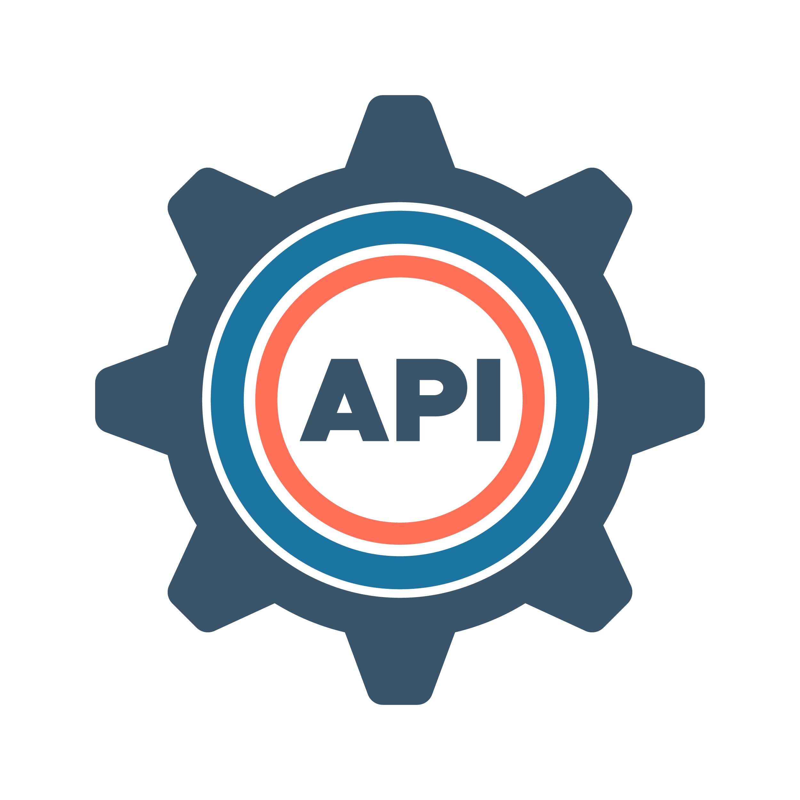
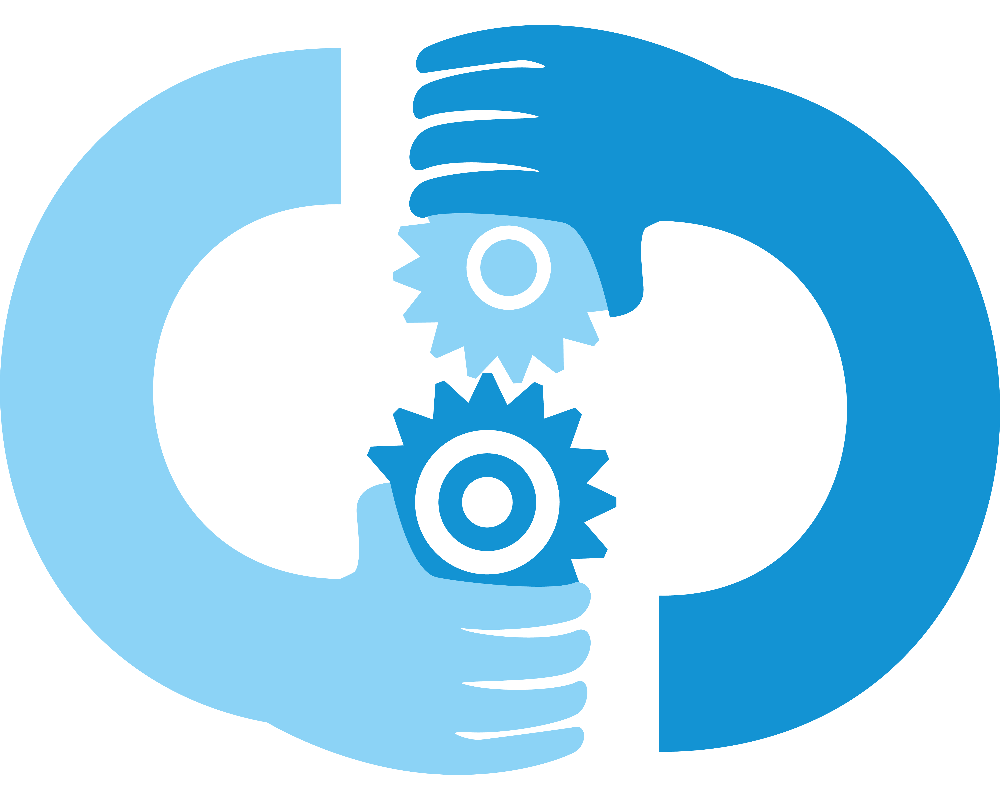

<p align="center">
  
  <h1 align="center">𝕎𝕖𝕝𝕔𝕠𝕞𝕖 𝕥𝕠 <a href="https://gumisofts.com">𝔾𝕦𝕞𝕚𝕤𝕠𝕗𝕥𝕤</a></h1>
  
  ```
                                                    Beyond software we build sucess
  ```
</p>

## 🌟 **About Us**

Gumisoft is a team of passionate developers, designers, and technology enthusiasts committed to delivering excellence. With years of experience in the tech industry, we have helped businesses of all sizes achieve their goals through innovative solutions and exceptional service.

### **Our Values**:

- **Innovation**: We stay ahead of the curve by embracing the latest technologies.
- **Quality**: We deliver robust and reliable solutions that exceed expectations.
- **Collaboration**: We work closely with our clients to understand their unique needs.
- **Transparency**: We believe in open communication and honesty in every project.

## Services

Here are some of the servies we provide

## **Software Development**


```
We create custom software solutions tailored to your requirements, ensuring scalability, security, and high performance.
```

### **Mobile Application Development**


```
From cross-platform to native mobile apps for iOS and Android, we deliver intuitive designs and seamless user experiences.
```

### **Website Development**


```
 We build responsive and visually appealing websites optimized for performance and user engagement.
```

### Web Application Development


```
 Our dynamic and interactive web applications are built with modern frameworks and technologies.
```

### **API Development**



```
We develop robust and secure APIs (RESTful and GraphQL) for seamless integration into your systems.
```

### **Command-line Applications**


```
We build efficient and powerful CLI tools for automation and productivity.
```

### **Desktop Applications**


```
We create feature-rich desktop applications for Windows, macOS, and Linux.

```

### **Automations**


```
We streamline your business processes with workflow automation and custom scripts.
```

### **SEO Services**


```
We boost your online visibility with data-driven SEO strategies.
```

### **DevOps & CI/CD**



```
We streamline development and deployment processes for faster delivery.
```

## 📫 **Get in Touch**

We’d love to hear from you! Whether you have a project in mind or just want to say hello, feel free to reach out:

- **Email**: [contact@gumiapps.com](mailto:contact@gumiapps.com)
- **Website**: [https://www.gumisofts.com/](https://www.gumisofts.com/)
- **LinkedIn**: [Gumisoft on LinkedIn](https://linkedin.com/company/gumisofts/)

---

## 💡 **Why Choose Gumisoft?**

- **Expert Team**: Our team consists of skilled professionals with diverse expertise.
- **Client-Centric Approach**: We prioritize your needs and deliver tailored solutions.
- **Proven Track Record**: We have successfully delivered projects across various industries.
- **Innovative Solutions**: We leverage the latest technologies to solve complex problems.

---

⭐️ From the **Gumisoft Team** – Let’s build the future together!
